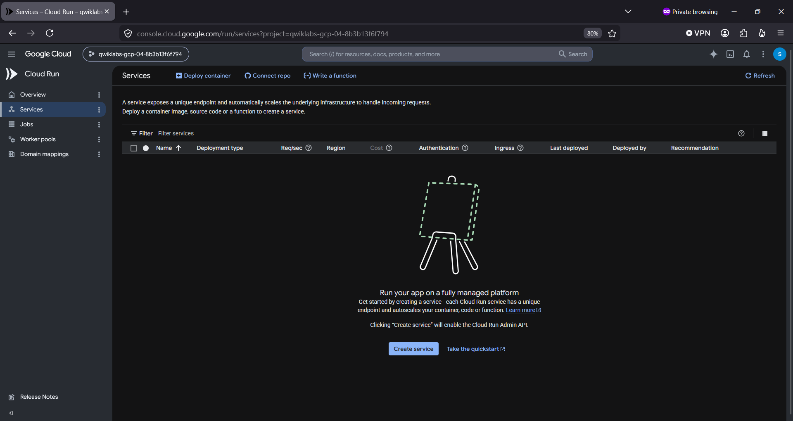
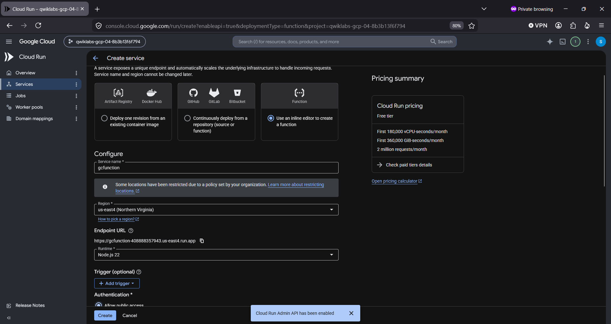
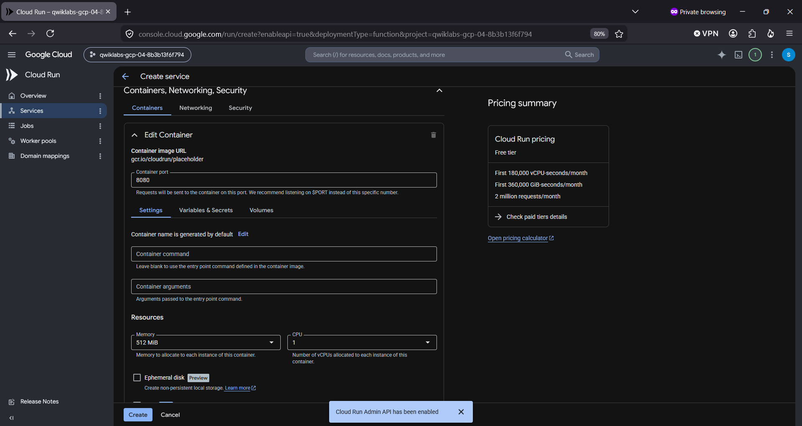
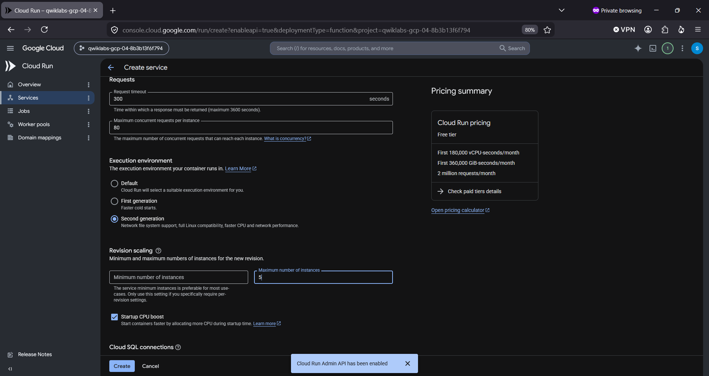
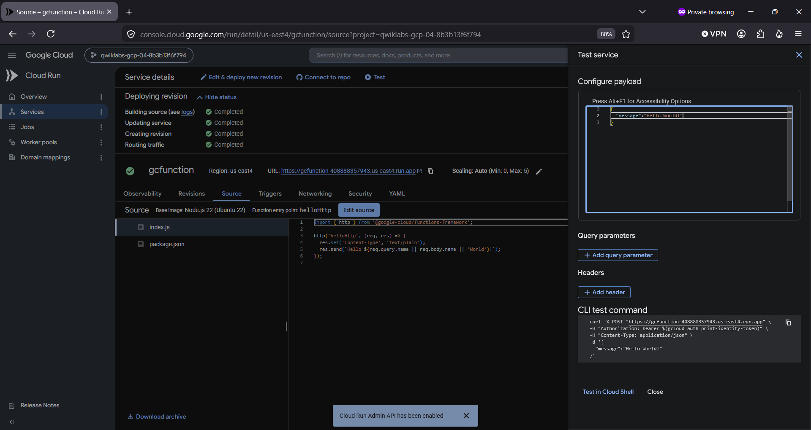
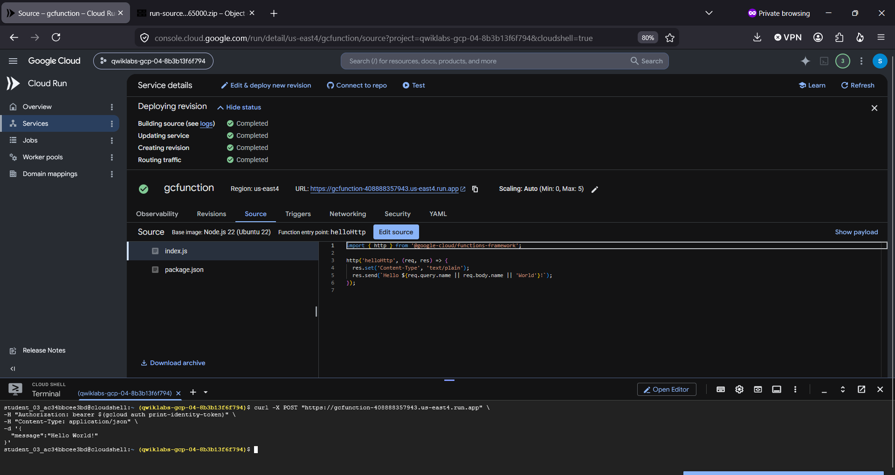
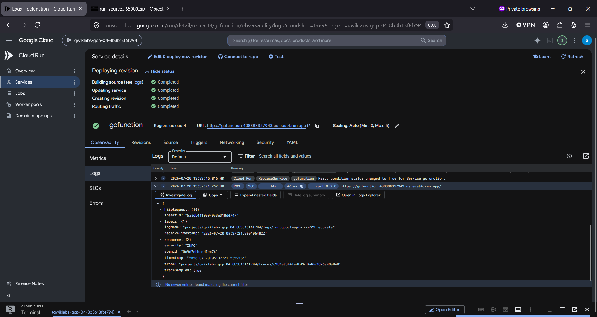
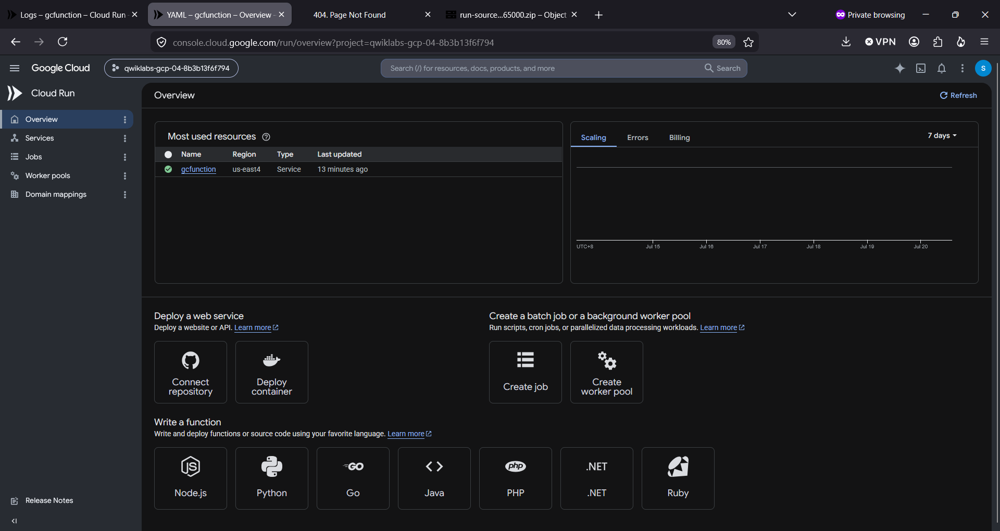
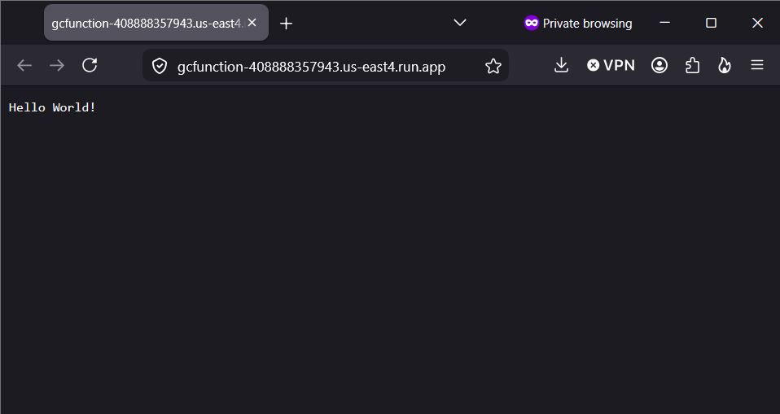
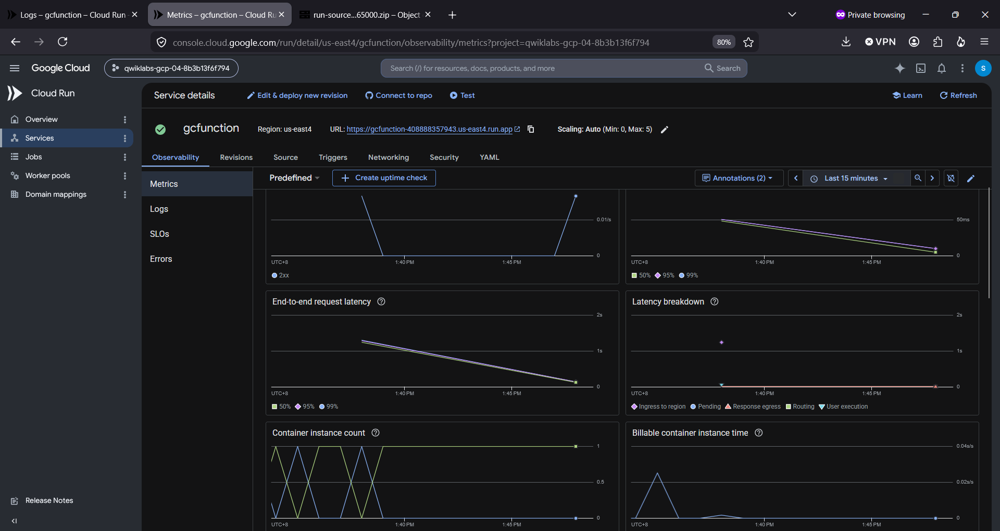

# nodejsrunfunc ☁️🏃
nodejsrunfunc : | Cloud Run Functions | Event-Driven, Trigger, Service, Node.js |

## Objectives
- Create a Cloud Run function
- Deploy and test the function
- View logs

## Cloud Run Functions

